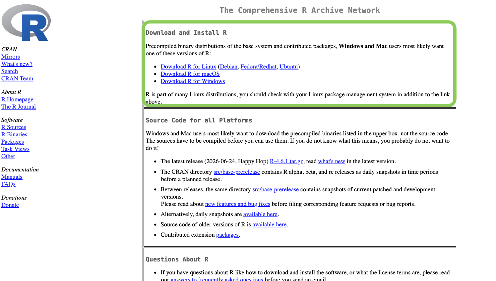
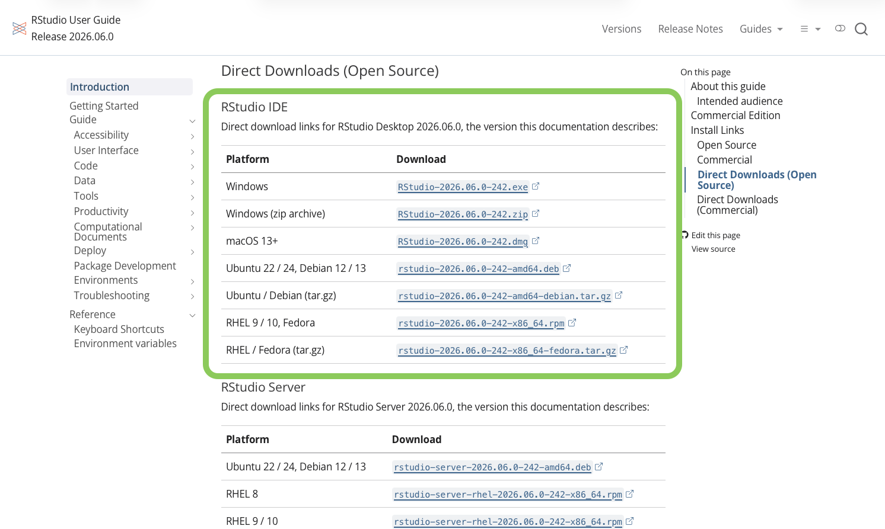
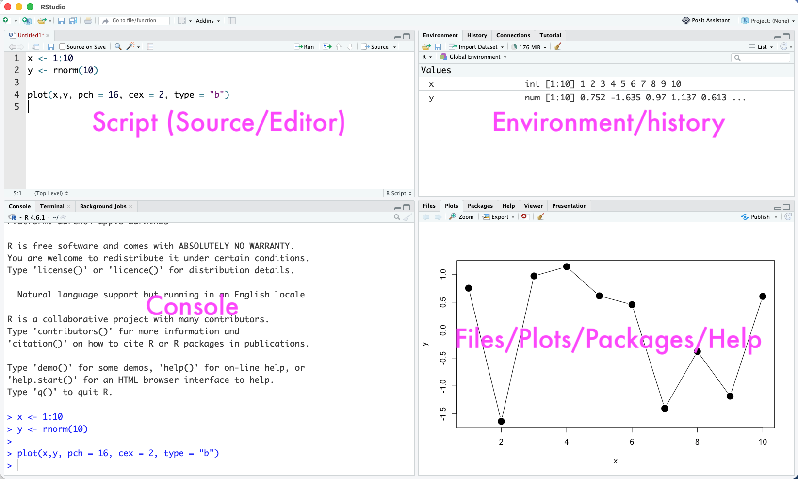

# Getting set up

**Learning goals**

By the end of this chapter you should be able to:

- Install R and RStudio on your own computer.
- Explain the difference between R and RStudio.
- Recognise the main parts of the RStudio window.
- Download the course data and put it where R can find it.

**Prerequisites**

- A laptop or desktop computer with an internet connection. That is all — this is the very first step.

**A tiny motivating example**

By the end of this short chapter you will be able to open RStudio, type a line like this into the console, press Enter, and see an answer:

```{r 0-01-getting-set-up-1}
1 + 1
```

If you can do that *and* import one of the course data files, you are ready to start.

---

## R and RStudio are two different things

It is worth being clear about this from the start, because it confuses almost everyone at first:

- **R** is the programming *language* and the engine that does the actual computing. On its own it is not much to look at.
- **RStudio** is a separate, much friendlier program — an "integrated development environment" (IDE) — that sits on top of R and makes it pleasant to use: somewhere to write scripts, run code, and see your results and plots side by side.

You install **both**, but once they are installed you only ever open **RStudio** — it starts R for you behind the scenes.

**Takeaway:** Install R *and* RStudio; work in RStudio.

---

## Installing R and RStudio

**What we're about to do:** Get both programs onto your computer, in the right order. There are **two separate downloads, from two different websites**.

**Step 1 — Install R (from CRAN).** Go to the official R website, CRAN, at <https://cran.r-project.org>. In the "Download and Install R" box at the top, choose the download for your operating system — **Download R for Windows** or **Download R for macOS** — then run the installer and accept the default options.

```{r 0-01-getting-set-up-cran, echo=FALSE, out.width="95%", fig.cap="Downloading R from CRAN: use the \"Download and Install R\" box at the top of the page."}

```

**Step 2 — Install RStudio Desktop (from Posit).** Go to <https://posit.co/download/rstudio-desktop/> and download the **RStudio Desktop** installer — the free, open-source version — for your operating system. Run it and again accept the defaults.

```{r 0-01-getting-set-up-rstudio-dl, echo=FALSE, out.width="95%", fig.cap="Downloading RStudio Desktop from Posit: choose the installer for your operating system."}

```

Install R **before** RStudio, so that RStudio can find it.

```{block 0-01-getting-set-up-2, type="do-something"}
**Do this now:** Install R (from CRAN), then RStudio (from Posit), then open **RStudio** (not R). You should see a window divided into panes, described next.
```

**Common mistake:** Opening "R" (a very plain window) instead of "RStudio". If the program you opened looks bare and old-fashioned, close it and open RStudio instead.

**Takeaway:** R first (from CRAN), then RStudio (from Posit); then only ever open RStudio.

---

## A quick tour of RStudio

**What we're about to do:** Get oriented so the window is not intimidating.

When you open RStudio you will see up to four panes. (You may see only three at first — the top-left one appears as soon as you open or create a script.)

- **Source / editor (top-left):** where you write and save your **scripts**. This is where most of your work happens.
- **Console (bottom-left):** where code actually runs and results appear. You can also type here directly for quick, throwaway commands.
- **Environment / History (top-right):** lists the **objects** (data sets, variables) currently loaded in R's memory.
- **Files / Plots / Packages / Help (bottom-right):** browse files on your computer, view **plots**, manage installed **packages**, and read **help** pages.

```{r 0-01-getting-set-up-panes, echo=FALSE, out.width="100%", fig.cap="The four panes of the RStudio window."}

```

```{block 0-01-getting-set-up-3, type="do-something"}
**Try this:** Click in the **Console**, type `1 + 1`, and press Enter. You should see the answer appear. Congratulations — R is working.
```

**Takeaway:** Four panes — editor, console, environment, and files/plots/help. You will use all of them.

---

## Get the course data

**What we're about to do:** Download the data used throughout the book and put it somewhere R can find it.

Almost every example in this book reads a data file from a folder called `CourseData`. Here is how to set that up:

1. **Download the data** from the course Dropbox folder:
   [https://www.dropbox.com/scl/fo/5tdl9dtflv79lkvq86vuj/h?rlkey=spw81m08re1ufef5uvxcopgla&dl=0](https://www.dropbox.com/scl/fo/5tdl9dtflv79lkvq86vuj/h?rlkey=spw81m08re1ufef5uvxcopgla&dl=0). Dropbox lets you download the whole folder as a single `.zip` file.
2. **Unzip it.** This gives you a folder called `CourseData` containing many `.csv` files.
3. **Put it in your project folder.** Move the `CourseData` folder inside the course project folder you will create in the *Paths and projects* chapter (the folder that contains your `.Rproj` file).

Once it is there, and you are working inside your RStudio Project, a command like this will just work — no long file paths required:

```{r 0-01-getting-set-up-4, eval = FALSE}
carni <- read.csv("CourseData/carnivora.csv")
```

**Common mistake:** an error such as `cannot open file 'CourseData/...': No such file or directory`. This almost always means the `CourseData` folder is not inside your project folder, or that you are not working inside your RStudio Project. The *Paths and projects* chapter explains how to fix this properly.

**Takeaway:** Keep `CourseData` inside your project folder and refer to files with short, relative paths.

---

## Key takeaways

- R is the engine; RStudio is the friendly interface. Install both, open RStudio.
- The RStudio window has four panes: editor, console, environment, and files/plots/help.
- Put the `CourseData` folder inside your project and refer to files with relative paths.

## Common pitfalls recap

- Opening R instead of RStudio.
- Installing RStudio before R.
- Downloading the data but leaving it in your Downloads folder, so R cannot find it.

## Mini-project

1. Install R and RStudio, and open RStudio.
2. In the Console, type `1 + 1` and then `R.version.string`, pressing Enter after each.
3. Download and unzip the course data, ready to move into your project folder in the next chapters.

You are now ready to set up a tidy project (see the *Paths and projects* chapter) and start learning R (see *An R refresher*).
